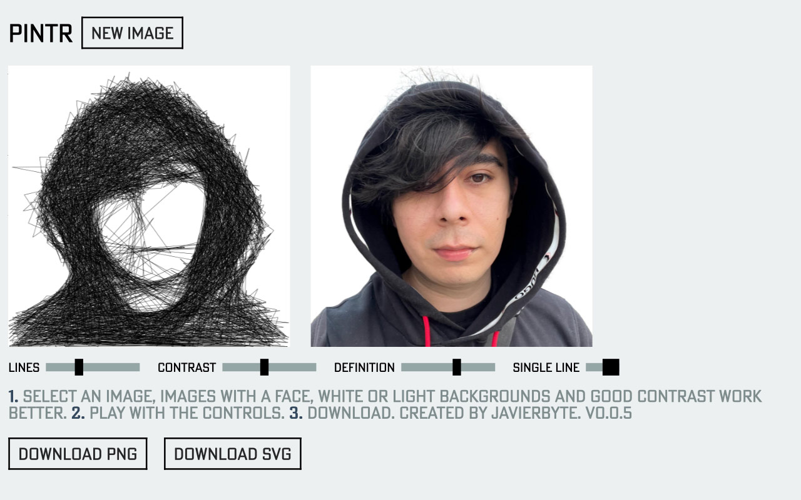
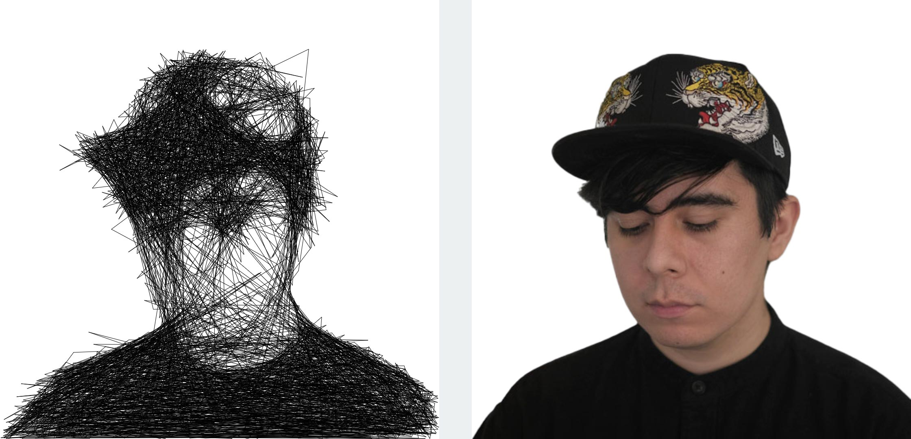
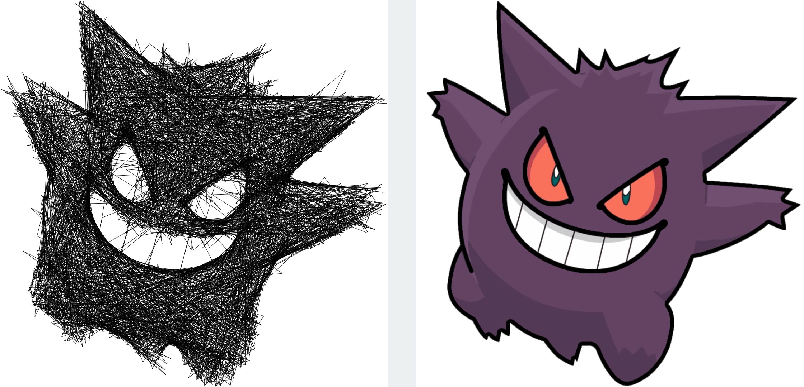
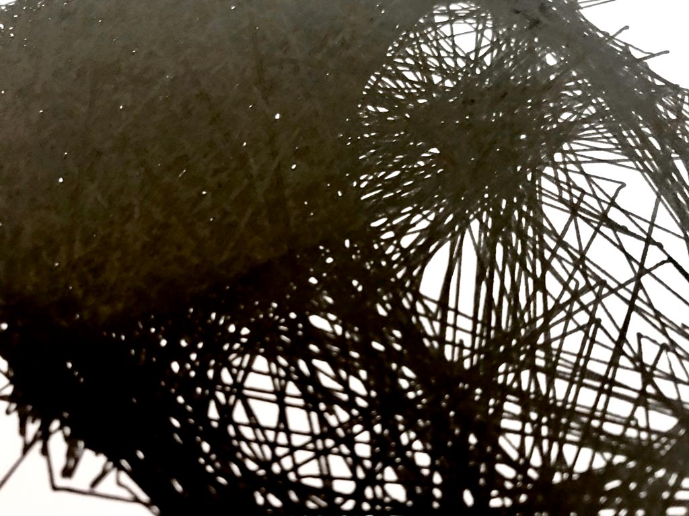
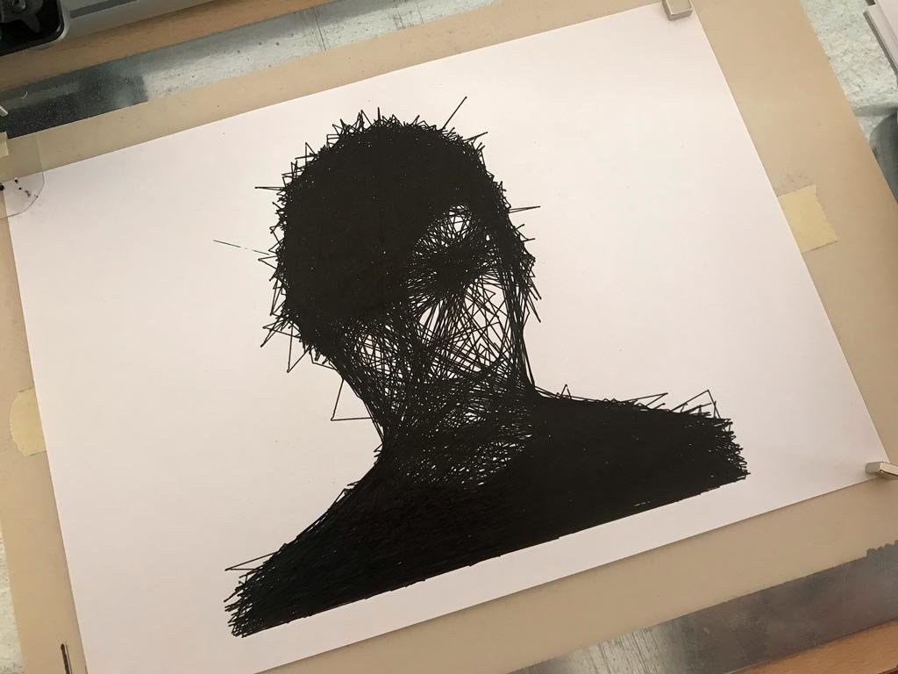

# [Pintr](https://javier.xyz/pintr/)

Turn your images into plotter-like line drawings, create single line SVG illustrations from your pictures.

All the processing is made locally, your images never leave your computer and you are free to use them as you please.

## Examples

## Plotter Art

Thanks [@sableRaph](https://twitter.com/sableRaph) for helping me create those. Using an AxiDraw.

https://user-images.githubusercontent.com/2009676/119021927-4ba5e000-b9a0-11eb-9ad7-1f9e54e823ae.mp4

### Animated Example

This is an exported SVG animated using [Vivus](https://maxwellito.github.io/vivus-instant/).

## How does it work?

1. The image is normalized for brightness and transformed to grayscale. See [canvasDataToGrayscale](https://github.com/javierbyte/pintr/blob/master/lib/canvasDataToGrayscale.js). I try to make the lightest zone white, and the darkest black.
2. A point in the canvas is selected at random and a line starts looking for different paths to draw next. At each step, the pencil draws imaginary lines to different points of the image and asks itself which one of those points would make the drawing look more like the original image, then it picks that one, draws the line and moves the cursor. The amount of imaginary lines is controlled by the "definition" slider. More lines mean more precise (but less terrifying) images. [See scan functions](https://github.com/javierbyte/pintr/blob/master/lib/scan.js)
3. Lines are [batched to be drawn](https://github.com/javierbyte/pintr/blob/master/lib/draw.js) and get flushed almost every frame.
4. Results are exported as svg as a very simple `polyline`, see [generateSvg](https://github.com/javierbyte/pintr/blob/master/lib/svg.js). PNG export is taken directly from the canvas.

Pixel data and resizing were made using [`canvas-image-utils`](https://github.com/javierbyte/canvas-image-utils), better face definition using [`face-api`](https://github.com/justadudewhohacks/face-api.js/).
